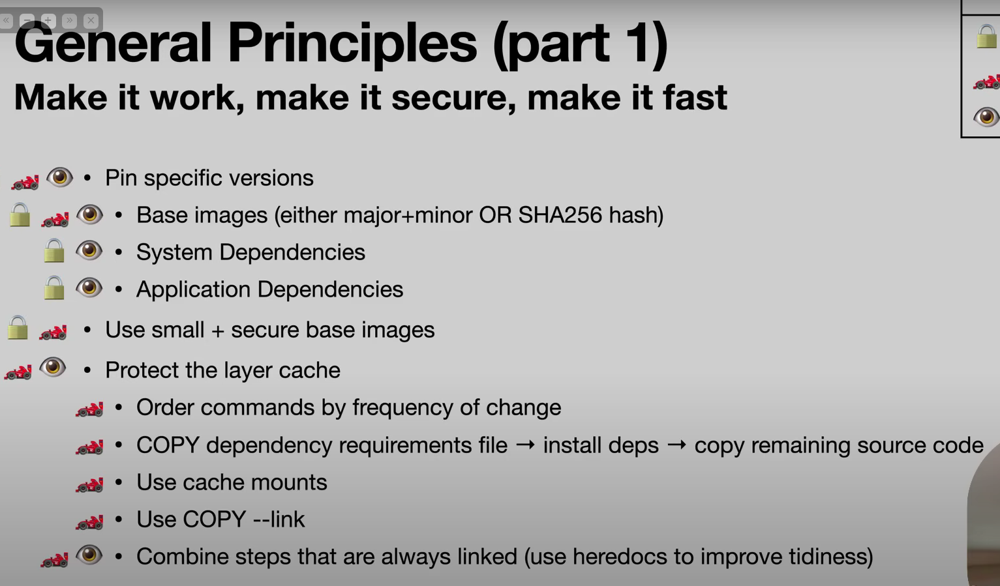

### Questions

1. What is the use of multi-stage builds in Docker?
2. What is the use of running an image as a non-root user and as a non root user?
3. How to reduce the size of Docker images?

4. What is the use of the `nginx` image and `nginx-unprivileged`?
5. What is the use of the `EXPOSE` command in the Dockerfile?
6. How do we make the image more secure and how to make it build faster?

### Note  
- Review all the Dockerfiles in the entire tutorial.

# **General Principles (Part 1)**  
## **Make it Work → Make it Secure → Make it Fast**  

### **1️⃣ Pin Specific Versions**  
- Always pin **base images** using **major + minor versions** or **SHA256 hashes** to prevent unexpected updates.  
- Lock **system dependencies** to avoid breaking changes.  
- Define **application dependencies** explicitly to ensure stability.  

### **2️⃣ Use Minimal & Secure Base Images**  
- Select **lightweight** base images to **reduce attack surface** and minimize vulnerabilities.  
- Prefer **distroless** or **Alpine-based** images when possible for security and efficiency.  

### **3️⃣ Optimize Layer Caching**  
- **Prioritize caching** by ordering commands based on frequency of change:  
  - Copy **dependency files** (`package.json`, `requirements.txt`) **first**.  
  - Install dependencies **before** copying the full source code.  
- **Leverage build cache efficiently:**  
  - Use **cache mounts** to improve layer reuse.  
  - Utilize `COPY --link` for optimized file transfers.  
  - Combine **related steps** using **heredocs** for better organization and efficiency.  
